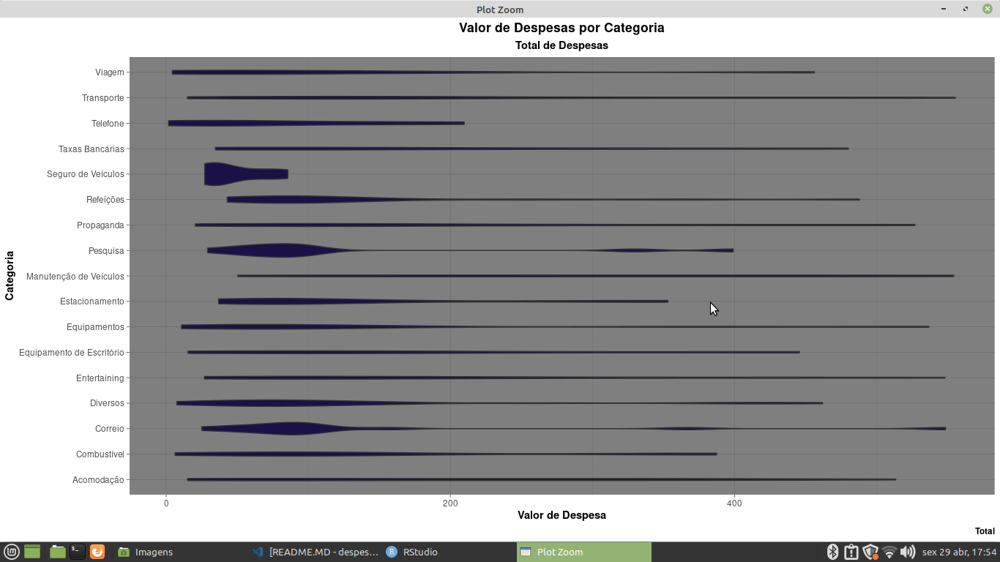
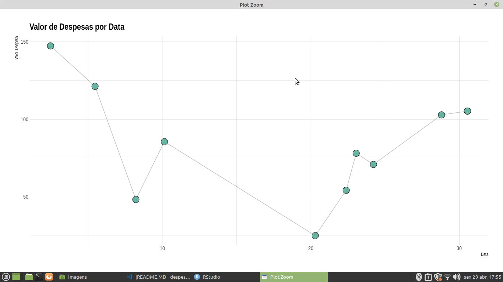

## Sobre o Projeto

** Despesas de Empresas ** 

* Conjunto de dados distribuido pela Data Science Academy, onde mostra as despesas das da empresa XYZ que vai obter lucros, faturamentos e apostas em investimentos de produtos.

* O objetivo dessa análise foi centrar na aquisição dos artefatos dos produtos que foram mais publicados pela gestão de marketing para campanhas publicitarias com a inteção de atrir novos clientes. 

## Tarefas para a planilhia Despesas de Empresas

** Total de Categoria por Valor de Despesa  ** 
   
** Valor de Despesas por Data  ** 

## Passos para a tarefa 

    1 - Importando o caminho do disco para a Linguagem 
    2 - Lendo o caminho do disco 
    3 - Instalando as bibliotecas para gerar gráficos e Agrupamento de dados
    4 - Lendo as Bibliotecas para gerar gráficos e Agrupamento de dados
    5 - Convertendo a Coluna Total de Compras em Reais R$, para calculos mais expressivos
    6 - Gerando Gráficos 
    
## Tecnologias Utilizadas 

** O projeto foi desenvolvido com as seguintes tecnologia ** 

- [R](https://www.r-project.org/)

## Pacotes Utilizados 

** Pacotes para a sessão de conversão de Strings

- [stringr](https://stringr.tidyverse.org/)

** Pacote para consultas de colunas 

- [tidyverse](https://www.tidyverse.org/)
- [dplyr](https://dplyr.tidyverse.org/) 

** Pacotes para a geração de Gráficos 

- [esquisse](https://www.littlemissdata.com/fdf/esquisse)
- [ggplot2](https://ggplot2.tidyverse.org/) 

## Bibliotecas para Geração de Gráficos das Despesas de Empresas

- [geom_bar](https://plotly.com/ggplot2/geom_bar/)
- [geom_point](https://plotly.com/ggplot2/geom_point/) 
- [geom_line](https://plotly.com/ggplot2/geom_line/)

## Imagens dos Gráficos de Despesas de Empresas

** Total de Categoria por Valor de Despesa ** 

** Valor de Despesas por Data  **

Desenvolvido por Gustavo Henrique de Souza Silva